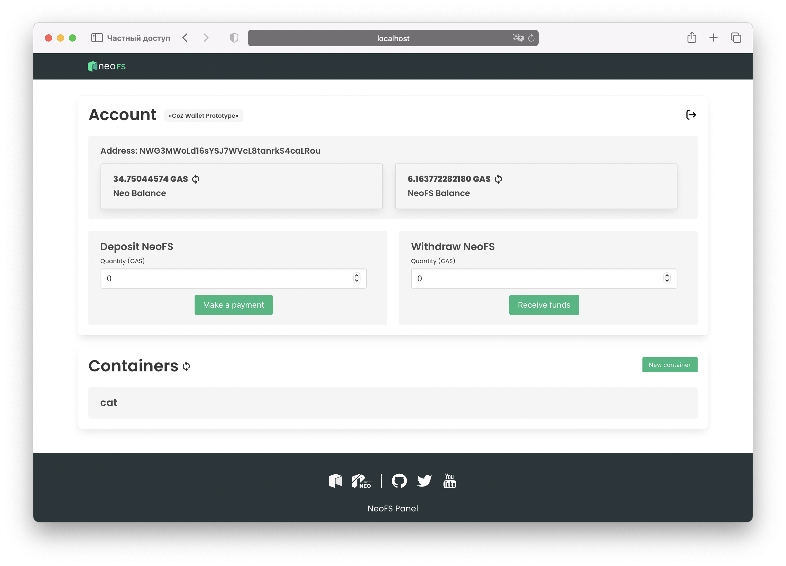

<p align="center">

</p>
<p align="center">
  <a href="https://fs.neo.org">NeoFS</a> is a decentralized distributed object storage integrated with the <a href="https://neo.org">NEO Blockchain</a>.
</p>

---


# Overview

NeoFS panel showcases NeoFS storage using REST API Gateway as a bridge. This web application is built with React framework under the hood and includes:

- Deposit and withdraw NeoFS contract
- Manage containers: all CRUD operations are available
- Manage objects: create objects with custom attributes, show them and delete
- Manage ACL and extended ACL fluently

# Requirements

- docker
- make
- node (`14+`)

# Quick Start
Clone repo:
```
$ git clone https://github.com/nspcc-dev/panel-fs-neo-org.git
```
Set variables in `.env` file
- `REACT_APP_WC_PROJECT_ID` - WalletConnect project id (Can be obtained on WalletConnect website, see https://cloud.walletconnect.com/app)
- `REACT_APP_URL` - Web application url
- `REACT_APP_RESTGW` - [NeoFS REST Gateway](https://github.com/nspcc-dev/neofs-rest-gw), which we use to manage containers and object in neofs (control path)
- `REACT_APP_HTTPGW` - [NeoFS HTTP Gateway](https://github.com/nspcc-dev/neofs-http-gw), which we use to get objects (data path)
- `REACT_APP_NEOFS_ACCOUNT` - Neo3 address of the NeoFS contract
- `REACT_APP_NEOFS_SCRIPT_HASH` - Script hash of the NeoFS contract
- `REACT_APP_NEOFS_GAS_TOKEN` - Script hash of the Gas token contract

Run next commands from project's root:
```
make start PORT=3000
```

# Make instructions
* Compile the build using `make` (will be generated in `output` dir)
* Start app using `make start PORT=3000` (PORT=3000 by default)
* Clean up cache directories using `make clean`
* Get release dir with tar.gz using `make release`

# Getting started
## Wallets
- [Aero web wallet](https://melanke.github.io/aero-beta/)
- [Neon wallet for Windows, Mac OS, Linux, Android and iOS](https://neon.coz.io/)

## Setup guide
1. Download [Neon wallet](https://neon.coz.io/) or open [Aero web wallet](https://melanke.github.io/aero-beta/)
2. Import wallet or generate a new one
3. Type wallet password
4. Choose your network (use `Testnet` for the best experience)
5. Make a new connection with Panel web page using Connect wallet button
6. Approve connection in the wallet
7. Now you can use your wallet on the NeoFS Panel

# Contributing

Feel free to contribute to this project after reading the [contributing
guidelines](CONTRIBUTING.md).

Before starting to work on a certain topic, create a new issue first, describing
the feature/topic you are going to implement.

# License

- [GNU General Public License v3.0](LICENSE)
