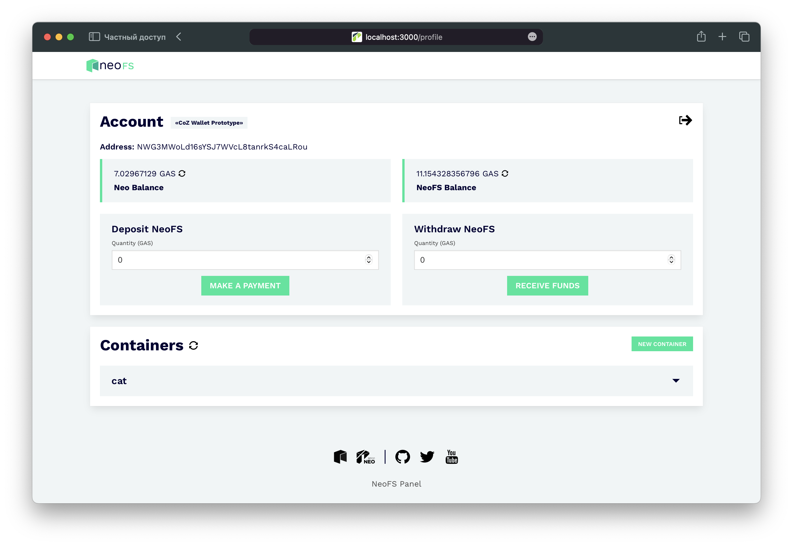

<p align="center">

</p>
<p align="center">
  <a href="https://fs.neo.org">NeoFS</a> is a decentralized distributed object storage integrated with the <a href="https://neo.org">NEO Blockchain</a>.
</p>

---




# Overview

NeoFS panel showcases NeoFS storage using REST API Gateway as a bridge. This web application is built with React
framework under the hood and includes:

- Deposit and withdraw NeoFS contract
- Manage containers: all CRUD operations are available
- Manage objects: create objects with custom attributes, show them and delete
- Manage ACL and extended ACL fluently

# Requirements

- docker
- make
- node (`18+`)

# Quick Start

Clone repo:

```
$ git clone https://github.com/nspcc-dev/panel-fs-neo-org.git
```

Set variables in `.env` file

- `VITE_WC_PROJECT_ID` - WalletConnect project id (Can be obtained on WalletConnect website,
  see https://cloud.walletconnect.com/app)
- `VITE_URL` - Web application url
- `VITE_RESTGW` - [NeoFS REST Gateway](https://github.com/nspcc-dev/neofs-rest-gw), which we use to manage
  containers and object in neofs (control path)
- `VITE_NETWORK` - Network of the Neo (might be `mainnet`, `testnet`)
- `VITE_NEOFS_ACCOUNT` - Neo3 address of the NeoFS contract
- `VITE_SIDECHAIN_RPC` - NeoFS side chain RPC node

Run next commands from project's root:

```shell
$ make
```

To run development build run:

```shell
$ make start
```

Optionally you can specify `PORT=3000`.

## Locally

You can easily run the node locally in a docker container using [@nspcc-dev/neofs-aio](https://github.com/nspcc-dev/neofs-aio).

You need to update the parameters in the `.env` file to make it work:

```env
VITE_RESTGW=http://localhost:8090
```

# Make instructions

* Compile the build using `make` (will be generated in `panel.fs.neo.org` dir)
* Start app using `make start` (PORT=3000 by default)
* Clean up cache directories using `make clean`
* Get release dir with tar.gz using `make release`

```shell
$ make docker/start
```

# Getting started

## Wallets

- [Neon wallet for Windows, Mac OS, Linux, Android and iOS](https://neon.coz.io/)
- [NeoLine wallet for chrome extension](https://neoline.io/)
- [O3 wallet](https://o3.network/#/wallet)
- [OneGate wallet (Mobile)](https://onegate.space/)
- [Aero web wallet](https://melanke.github.io/aero-beta/) (testnet only, see #133)

## Setup guide

1. Open [Neon wallet](https://neon.coz.io/)
2. Import a key or generate a new one
3. Type wallet password
4. Choose your network (depending on how Panel is configured)
5. Make a new connection with Panel web page using "Connect wallet" button
6. Approve connection in the wallet
7. Now you can use your wallet on the NeoFS Panel

# Contributing

Feel free to contribute to this project after reading the [contributing
guidelines](CONTRIBUTING.md).

Before starting to work on a certain topic, create a new issue first, describing
the feature/topic you are going to implement.

# License

- [GNU General Public License v3.0](LICENSE)
